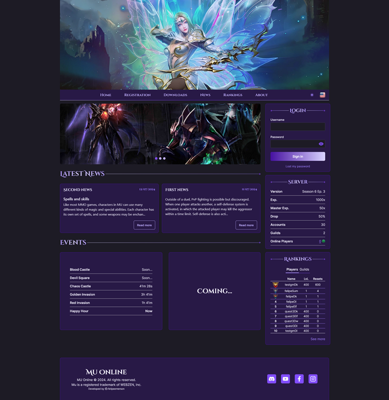

<div id="top"></div>

<!-- PROJECT LOGO -->
<br />
<div align="center">

  <h1 align="center">OpenMU CMS</h1>

  <p align="center">
    Open MU CMS to work with MUnique Open MU
  </p>
</div>

<!-- SUMMARY -->
<details>
  <summary>Summary</summary>
  <ol>
    <li><a href="#about">About</a></li>
    <li><a href="#layout">Layout</a></li>
    <li><a href="#features">Features</a></li>
    <li><a href="#built-with">Built With</a></li>
    <li>
      <a href="#how-it-works">How it works</a>
      <ul>
        <li><a href="#pre-requisites">Pre-requisites</li>
        <li><a href="#running-server">Running server (Development)</li>
        <li><a href="#running-client">Running client (Development)</li>
        <li><a href="#deployment">Deployment</li>
      </ul>
    </li>
    <li>
      <a href="#themes">Themes</a>
      <ul>
        <li><a href="#green">Green</li>
        <li><a href="#blue">Blue</li>
        <li><a href="#pink">Pink</li>
      </ul>
    </li>
    <li><a href="#license">License</a></li>
  </ol>
</details>

<!-- ABOUT -->

## About

This project consists of a CMS specifically developed to work with [MUnique OpenMU](https://github.com/MUnique/OpenMU). The CMS includes a client developed with React and a server developed with Spring Boot.

<p align="right">(<a href="#top">back to top</a>)</p>

<!-- LAYOUT -->

## Layout

<p align="center" style="display: flex; align-items: flex-start; justify-content: center;">
  
  
  
  
</p>

<p align="right">(<a href="#top">back to top</a>)</p>

<!-- FEATURES -->

## Features

- [x] Create account
- [x] Login
- [ ] Recover password
- [x] Change password
- [x] Create/edit/update/remove banners (only Game Masters)
- [x] Create/edit/update/remove news (only Game Masters)
- [x] Players and guilds rankings (with pagination)
- [x] Account page (list of characters and personal data)
- [x] Reset Character
- [x] Add stats points
- [x] Guild page
- [x] Online players page
- [x] Events countdown
- [x] Server statictics
- [x] Internationalization (with english and portuguese locales)
- [x] Dark and Light theme
- [x] Three color palettes
- [x] Docker deploy files wih OpenMU

<p align="right">(<a href="#top">back to top</a>)</p>

<!-- BUILT WITH -->

## Built With

- **Client**: React 18, Vite.js, TypeScript and TailwindCSS.
- **Server**: Java 17, Maven and Spring Boot 3.

<p align="right">(<a href="#top">back to top</a>)</p>

## How it works

### Pre-requisites

Before you begin, you will need to have the following tools installed on your machine: [Git](https://git-scm.com), [Node.js](https://nodejs.org/en/) and [Java 17 JDK](https://www.oracle.com/java/technologies/javase/jdk17-archive-downloads.html).
In addition, it is good to have an editor to work with the client code like [VSCode](https://code.visualstudio.com/) and an IDE like [IntelliJ](https://www.jetbrains.com/idea/) to work with the server.

### Running server (Development)

To run the server, first you need to generate an RSA public-private key pair ([how to create](https://docs.oracle.com/cd/E19683-01/806-4078/6jd6cjru7/index.html) or [create online](https://cryptotools.net/rsagen)). The private key should be named `app.key` and the public key `app.pub`. Both files should be placed inside `server/src/main/resources`.
Additionally, you need to configure the environment variables for the database and the OpenMU administration panel - [is easy to configure with IntelliJ](https://www.baeldung.com/intellij-idea-environment-variables). The default configuration is:

```plaintext
DB_HOST=localhost
DB_PORT=5433
DB_NAME=openmu
DB_USERNAME=postgres
DB_PASSWORD=admin
ADMIN_PANEL_USERNAME=admin
ADMIN_PANEL_PASSWORD=openmu
ADMIN_PANEL_HOST=localhost
ADMIN_PANEL_PORT=80
```

Some settings related to OpenMU settings (like level required to reset, points per reset and others) need to be adjusted appropriately in the class `/server/src/main/java/io/github/felipeemerson/openmuapi/configuration/SystemConstants.java`.

Command to run the server (server is available at port 8080):

```bash
.\mvnw spring-boot:run
```

### Running client (Development)

To run the client, first install the necessary dependencies with the command bellow:

```bash
npm install
```

Then, create a .env file in the /client root directory with the following variables:

```plaintext
VITE_API_URL=http://localhost:8080
VITE_MAX_BANNERS=5
VITE_LEVEL_REQUIRED_TO_RESET=400
VITE_MAX_STAT_POINTS=65535
```

The VITE_API_URL is the server URL, VITE_MAX_BANNERS is the maximum number of possible banners, VITE_MAX_STAT_POINTS is the maximum value of an character attribute, and VITE_LEVEL_REQUIRED_TO_RESET is the level required to reset.

Command to run the client (client is available at port 5173):

```bash
npm run dev
```

You can change between theme colors in the file `client/src/public/colors.ts`. The client has 4 themes (purple, blue, green and pink), to set a theme just change the `primary` key of the colors variable to the variable of the theme that you want:

```js
export const colors = {
  primary: primary, // or green or pink or blue
```

### Deployment

Initially, there are two deployment options with OpenMU included: [Local Testing](https://github.com/felipeemerson/open-mu-cms/blob/main/deploy/local-testing/) and [Production](https://github.com/felipeemerson/open-mu-cms/blob/main/deploy/production/).

<p align="right">(<a href="#top">back to top</a>)</p>

<!-- THEMES -->

## Themes

### Green

<p align="center" style="display: flex; align-items: flex-start; justify-content: center;">
  
  
  
  
</p>

### Blue

<p align="center" style="display: flex; align-items: flex-start; justify-content: center;">
  
  
  
  
</p>

### Pink

<p align="center" style="display: flex; align-items: flex-start; justify-content: center;">
  
  
  
  
</p>

<p align="right">(<a href="#top">back to top</a>)</p>

<!-- LICENSE -->

## License

Distributed under the MIT License. See `LICENSE.txt` for more information.

<p align="right">(<a href="#top">back to top</a>)</p>
